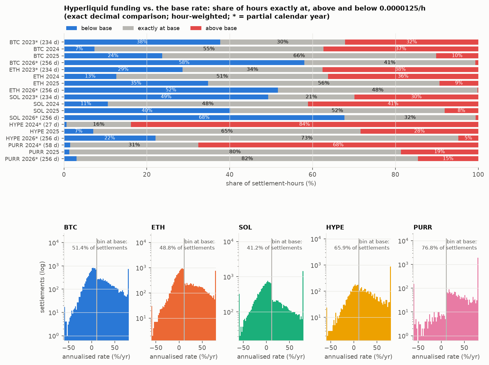
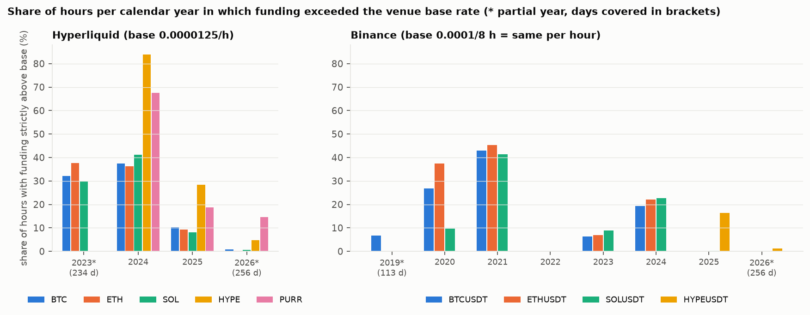
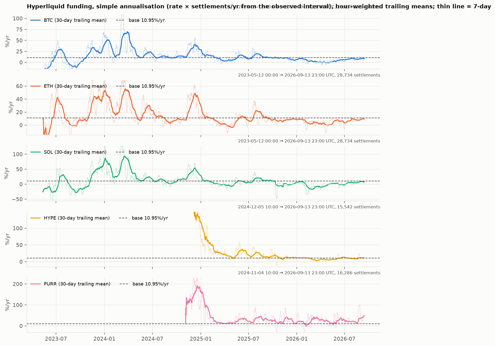
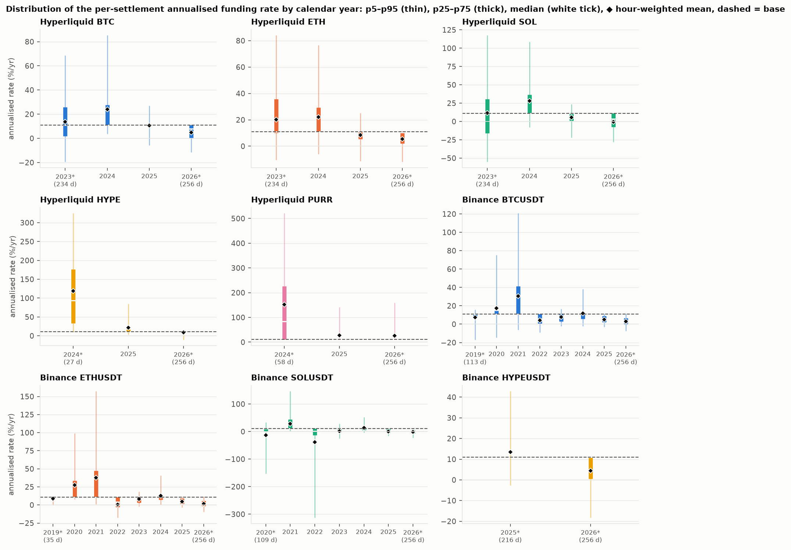
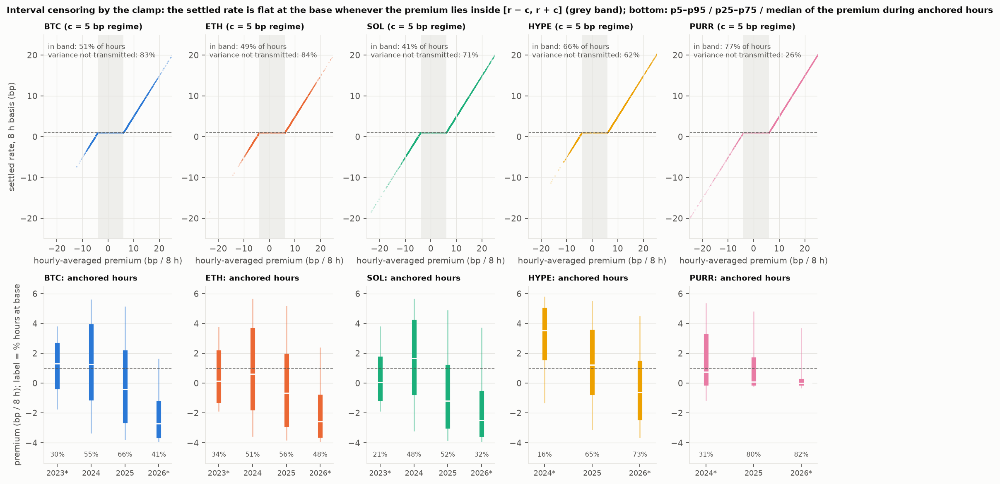
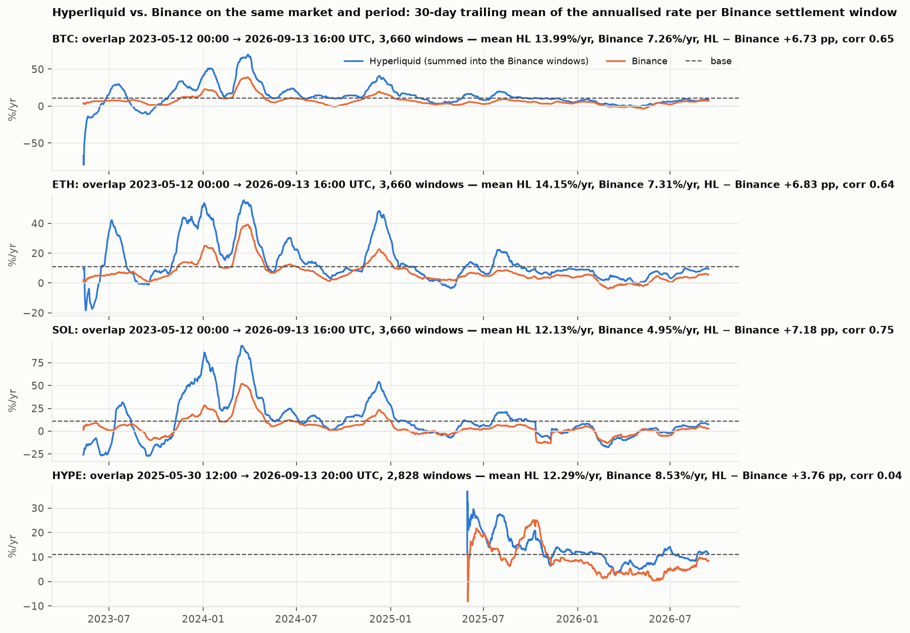
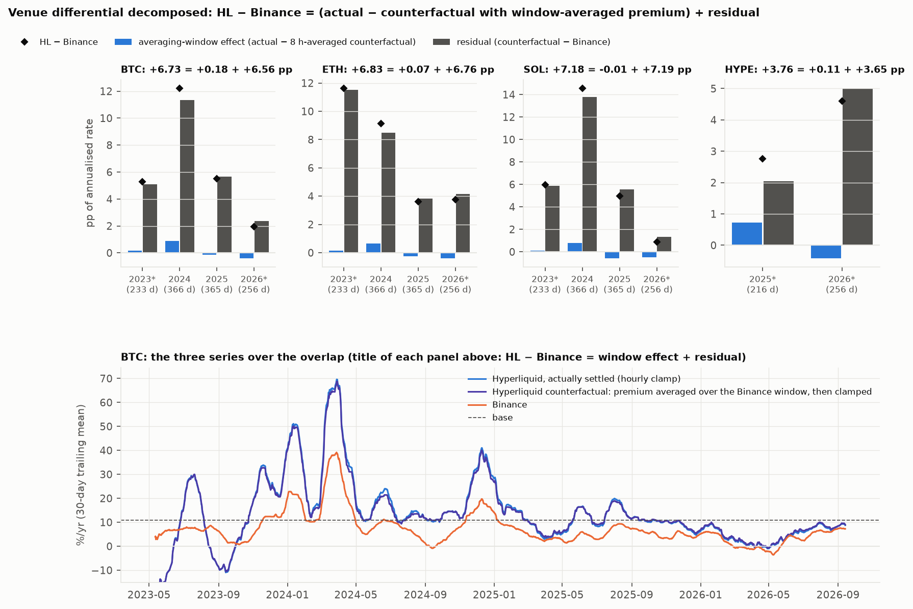
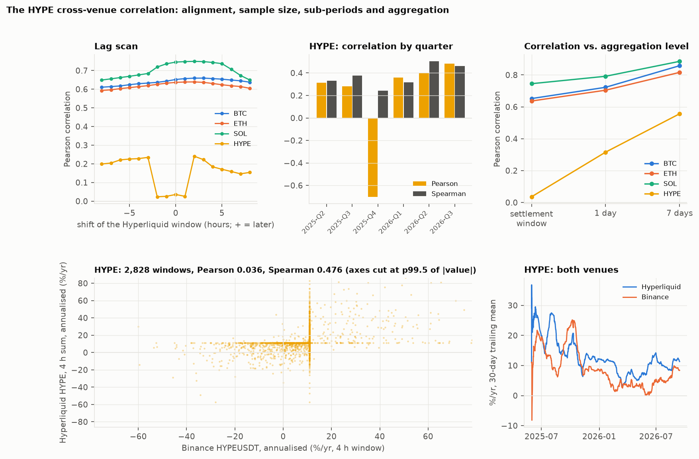

# Perpetual funding on Hyperliquid and Binance: is there a carry to capture?

Research note. Version of 2026-09-15.

The funding carry existed and it is gone. On Hyperliquid, BTC funding was strictly
above the venue's base rate in 37.3 % of hours in 2024 and in 0.7 % of hours in
2026 to date, and its hour-weighted annualised mean fell from 24.14 %/yr to
4.73 %/yr; Binance BTCUSDT made the same move, from 11.92 %/yr to 2.79 %/yr (§1,
§3.2). The clamp band that Hyperliquid documents at ±0.05 % was not constant: the
settled series implies a half-width of 3 bp from 2023-05-12, no clamp and no
interest component for 677 hours from 2023-06-16, 3 bp again from 2023-07-15, and
the documented 5 bp only from 2023-12-11 23:00 UTC (§3.1). And the settled funding
series is an interval-censored observation of the premium: on Hyperliquid, 83.5 %
of the BTC premium's variance never reaches the settled rate (§3.3).

## 1. Question and answer

The study started from a practical question: is a delta-neutral funding-capture
strategy (long spot or a hedge, short the perpetual, collect the funding paid to
shorts) viable on Hyperliquid, and is it viable against what Binance offers on the
same assets?

The measured answer is **not under the current regime**, and the qualifier is the
result, not a hedge. The carry existed, it was large in 2024, and it has been
absent since 2025. On Hyperliquid the hour-weighted share of hours in which BTC
funding was strictly above the venue's base rate was 37.3 % in 2024 and 0.7 % in
the partial year 2026 (256 days to 2026-09-13); ETH went from 36.3 % to 0.2 %, SOL
from 41.1 % to 0.7 % (docs/03 §2 and §4, Figure 2). The hour-weighted annualised
mean went from 24.14 / 22.05 / 28.14 %/yr in 2024 to 4.73 / 5.44 / −0.67 %/yr in
2026 for BTC / ETH / SOL (docs/03 §3 and §7). On Binance, the only venue with
pre-2023 history, BTCUSDT averaged 30.61 %/yr in 2021, 4.16 % in 2022, 11.92 % in
2024 and 2.79 % in 2026 (docs/03 §4 and §7); the share of settlements above the
base was 42.9 % in 2021 and 0.0 % in 2025 and 2026 (docs/03 §4). The path is not
monotonic: 2022 was already at the 2026 level and 2024 rebounded. Nothing in the
funding mechanism prevents the upper tail from returning; the data say when it was
there and when it left.

The rest of the note is about what the series look like once the question is
answered, and one of those observations is arguably the more useful result:
the funding series that everyone downloads is an interval-censored observation of
the premium, and the censoring band on Hyperliquid has not been constant.

## 2. Data and method

Two public endpoints, no credentials: Hyperliquid `fundingHistory` and Binance
USDⓈ-M `fapi/v1/fundingRate`. Nine series: BTC, ETH, SOL, HYPE and PURR on
Hyperliquid (hourly settlement), BTCUSDT, ETHUSDT, SOLUSDT (8 h) and HYPEUSDT
(4 h) on Binance. The analysed dataset is `data/full/`, the full retained history
of both APIs, frozen with SHA-256 sums; its inventory is in docs/03 §0. Hyperliquid
retains history from 2023-05-12 for BTC/ETH/SOL, from 2024-12-05 for HYPE and
2024-11-04 for PURR; Binance from 2019-09-10 (BTCUSDT), 2019-11-27 (ETHUSDT),
2020-09-13 (SOLUSDT) and 2025-05-30 (HYPEUSDT) (docs/03 §0, docs/01 §8).

The calculation rules are in docs/03 §1. The ones that matter for reading the
numbers:

- **Base rate.** Both venues use an interest-rate component of 0.01 % per 8 h,
  i.e. 0.0000125 per hour; annualised with the simple convention (rate × settlements
  per year) it is 10.95 %/yr (docs/01 §7, docs/03 §1). The same convention is
  applied to observed rates and to the base; the classification above / at / below
  base is an exact decimal comparison of the API string and is invariant to the
  convention (docs/03 §2.1).
- **Cadence is observed, never assumed.** Settlements per year come from the delta
  between consecutive timestamps. This matters for SOLUSDT in November 2022 and for
  Hyperliquid's own first weeks (docs/03 §0.2, §7 below).
- **Means are hour-weighted; medians are per settlement.** Extreme annualised
  values are cadence artefacts of a capped rate at a short interval, not errors
  (docs/03 §7).
- **Venue comparison** sums Hyperliquid hourly rates into each Binance settlement
  window and annualises both sides with the same interval (docs/03 §1 rule 8, §5).
- **Premium.** Hyperliquid's endpoint returns the averaged premium next to the
  settled rate; Binance's does not. Everything about the premium is therefore
  Hyperliquid-only (docs/03 §8).

The original working figures that motivated the study were recomputed on their
window and on the full history; all five annual means and both "share above base"
figures reproduce to rounding (docs/04 §1), and docs/04 §2 states which claims
survive on the full history.

All numbers in this note are taken from `results/analysis.json` or from the
documents that `scripts/analyse.py` and `scripts/analyse_clamp.py` generate from it
(`docs/03-analysis.md`, `docs/04-discrepancies.md`); each number is followed by
the section or figure it comes from. Nothing in this note is typed from memory.

## 3. Findings

### 3.1 The clamp band on Hyperliquid was not constant: four regimes inferred from the data

Both venues document the same formula: F = P + clamp(r − P, −c, +c), where P is
the averaged premium, r the interest rate and c the half-width of the band
(docs/01 §7; sources in §4 below). Whenever the settled rate is not exactly at the
base, the formula puts F exactly c away from P, so |P − F| reveals c for every
off-base settlement. Runs of at least 24 consecutive off-base settlements with the
same implied c define a regime, and a regime starts at the first settlement the
previous c cannot reproduce. Every settlement is then checked against the formula
with its regime's c at a tolerance of 1e-9 (docs/03 §8.1).

The result for BTC, ETH and SOL, with boundaries that coincide to the hour across
the three markets (docs/03 §8.1, table):

| Regime | From (UTC) | To (UTC) | Half-width c (8 h basis) |
|---|---|---|---|
| 1 | 2023-05-12 00:00 | 2023-06-16 20:00 | 3 bp (±0.03 %) |
| 2 | 2023-06-16 21:00 | 2023-07-15 02:00 | 0: F = P, no interest component, no clamp (677 settlements) |
| 3 | 2023-07-15 03:00 | 2023-12-11 22:00 | 3 bp |
| 4 | 2023-12-11 23:00 | end of data | 5 bp (±0.05 %), the documented value |

HYPE and PURR were listed after the last change and show a single regime at 5 bp.
Under this c(t) the formula reproduces 118,022 of 118,030 Hyperliquid settlements
exactly. The 8 it does not reproduce are 1 BTC settlement at 2023-07-16 01:00 and
7 ETH settlements from 2023-07-16 01:00 to 14:00, both with an implied c of 2 bp,
which the 24-settlement rule ignores as a run (docs/03 §8.1). They are reported,
not explained.

Two consequences. During regime 2 no hour can be "at base", because there was no
base to be pinned to; and "at base" in every other regime means "premium inside
[r − c(t), r + c(t)]" with the c(t) above, not the documented ±0.05 % throughout
(docs/03 §8.1). The documented band holds from 2023-12-11 23:00 UTC onward.

**Status of this result.** It is an inference from the published series, not a
fact confirmed by the venue. Before this note was written, public communication
from Hyperliquid was searched for at the three change dates and for the 677-hour
window with F = P:

- Hyperliquid documentation, *Trading → Funding* (GitBook), and the community wiki
  page on funding: both describe only the current formula and carry no history of
  parameter values.
- Hyperliquid's public Telegram announcements channel: its first post is dated
  2023-09-26, so it cannot cover June or July 2023. The pages covering
  2023-09-26 to 2024-01-04, which include 2023-12-11, were read; no post mentions
  funding parameters, the premium, the interest rate or a band change.
- Hyperliquid's Medium quarterly updates for Q2 and Q3 2023 could not be retrieved
  from this session (HTTP 403); the app's announcements page renders no content
  without a browser; Discord is not accessible.
- General web search for the dates and the terms returned only third-party
  explainers of the current formula.
- The Wayback Machine (web.archive.org), checked manually for the documentation
  site `hyperliquid.gitbook.io/hyperliquid-docs`. Each capture is cited as
  `web.archive.org/web/TIMESTAMP/URL` with the timestamp of the archived capture,
  taken from the domain's CDX index:
  - The page *trading/funding* has no archived capture in 2023. Its first capture
    is from 2024, already under the ±5 bp regime. This comes from a manual query
    of the domain's CDX index; no individual capture is cited for it.
  - The CDX index confirms that the crawler did capture sister pages of *trading/*
    during 2023: *margining* on 2023-05-03
    (<https://web.archive.org/web/20230503111039/https://hyperliquid.gitbook.io/hyperliquid-docs/trading/margining>),
    *index-perpetual-contracts* on 2023-10-12
    (<https://web.archive.org/web/20231012183856/https://hyperliquid.gitbook.io/hyperliquid-docs/trading/index-perpetual-contracts>),
    *fees* on 2023-10-18
    (<https://web.archive.org/web/20231018140922/https://hyperliquid.gitbook.io/hyperliquid-docs/trading/fees>) and
    *hyperps* on 2023-10-27
    (<https://web.archive.org/web/20231027221626/https://hyperliquid.gitbook.io/hyperliquid-docs/trading/hyperps>).
    The absence of *funding* is a crawl gap, not the absence of the page.
  - The archived sitemap captured on 2023-05-25
    (<https://web.archive.org/web/20230525044309/https://hyperliquid.gitbook.io/hyperliquid-docs/sitemap.xml>)
    lists *trading/funding* with a last-modified date of 2023-05-19, so the page
    existed during the variable-band period. It cannot be claimed that funding was
    undocumented in that period.
  - The capture of the *trading* index of 2023-04-25
    (<https://web.archive.org/web/20230425233118/https://hyperliquid.gitbook.io/hyperliquid-docs/trading>)
    shows eight articles in the section, and *Funding* is not among them; it
    appears as the previous page in the navigation order. This indicates that the
    page was moved into *trading/* between late April and 2023-05-19.
  - Hyperliquid was still in its mainnet-alpha phase during the reconstructed
    period, according to the archived pages
    *getting-started/trade-on-mainnet-alpha*, captured on 2023-05-25
    (<https://web.archive.org/web/20230525030206/https://hyperliquid.gitbook.io/hyperliquid-docs/getting-started/trade-on-mainnet-alpha>),
    and *getting-started/earn-access-to-mainnet-alpha*, captured on 2023-09-27
    (<https://web.archive.org/web/20230927111608/https://hyperliquid.gitbook.io/hyperliquid-docs/getting-started/earn-access-to-mainnet-alpha>).

**There is no archived evidence of the band's value before December 2023, and no
public communication was located for the three change dates** (2023-06-16,
2023-07-15, 2023-12-11) or for the F = P window. The open route for independent
corroboration is the venue's own historical archive in the S3 bucket
`hyperliquid-archive`, with asset contexts under `asset_ctxs/`, which is a source
distinct from the `fundingHistory` endpoint used in this study; it is named here as
a verification path, not as something done. None of this changes the
reconstruction of the band, which rests on the 118,022 of 118,030 settlements
reproduced. Two other venue-wide events visible in the same
data are independent of the band and are recorded in docs/03 §0.2: the cadence
change from 8 h to 1 h settlement on 2023-06-08, and three omitted hourly
settlements (2023-07-02 20:00, 2023-08-23 20:00, 2024-08-15 13:00).

### 3.2 The regime change in the upper tail, on both venues

The distribution of settled funding is a point mass at the base with two tails
(docs/03 §2, Figure 0). Over the whole retained history the share of hours exactly
at base is 50.8 % for BTC, 48.6 % ETH, 40.6 % SOL, 65.9 % HYPE and 76.8 % PURR, and
the median annualised rate is the base itself, 10.95 %/yr, in all eight full
Hyperliquid market-years (docs/03 §7). Means are driven by the tails.



*Figure 0. Top: hour-weighted share of hours at, above and below the base per market-year. Bottom: histogram of the annualised hourly rate per market (2 pp bins, log scale); the grey bar is the bin containing the base. From docs/03 §2.*

The upper tail thinned out between 2024 and 2025 and is almost gone in 2026:

| Market | Above base 2024 | Above base 2025 | Above base 2026* | Below base 2026* |
|---|---|---|---|---|
| Hyperliquid BTC | 37.3 % | 10.2 % | 0.7 % | 58.0 % |
| Hyperliquid ETH | 36.3 % | 9.3 % | 0.2 % | 51.6 % |
| Hyperliquid SOL | 41.1 % | 8.1 % | 0.7 % | 67.7 % |
| Binance BTCUSDT | 19.4 % | 0.0 % | 0.0 % | 93.5 % |
| Binance ETHUSDT | 22.0 % | 0.0 % | 0.0 % | 95.1 % |
| Binance SOLUSDT | 22.7 % | 0.2 % | 0.0 % | 88.0 % |

Hour-weighted shares, docs/03 §2 and §4, Figure 2; * partial year, 256 days.



*Figure 2. Hour-weighted share of each calendar year in which funding was strictly above the venue base, Hyperliquid on the left and Binance on the right, with the same base per hour on both. From docs/03 §2 and §4.*

In annualised means the same move is 24.14 → 10.63 → 4.73 %/yr for BTC on
Hyperliquid across 2024, 2025 and 2026, and 11.92 → 5.13 → 2.79 %/yr for BTCUSDT
on Binance (docs/03 §3 and §4, Figures 1 and 4). Binance's longer history shows
the earlier cycle: 30.61 / 37.54 / 28.59 %/yr for BTCUSDT / ETHUSDT / SOLUSDT in
2021, then 4.16 / 0.79 / −38.00 in 2022 (docs/03 §6, §7). The 2022 SOLUSDT figure
carries the −2 % cap settled every 2 h during November 2022, annualised at its real
interval (docs/03 §7).



*Figure 1. Simple-annualised Hyperliquid funding, hour-weighted trailing means over 30 days (thick line) and 7 days (thin line); the dashed line is the base of 10.95 %/yr. From docs/03 §3.*



*Figure 4. Per-settlement annualised rate by calendar year: 5th to 95th percentile, interquartile range, median and hour-weighted mean; the dashed line is the base. From docs/03 §7.*

The decline is on both venues and the venue is not what makes recent funding low;
if anything Binance is lower (docs/03 §7, docs/04 §2).

### 3.3 The settled series is an interval-censored observation of the premium (Hyperliquid only)

Inside the band the settled rate is a constant and carries no information about
where the premium sits. Using the premium field, docs/03 §8.2 measures how much
of the premium the settled series fails to transmit, as 1 − Var(F) / Var(P) with
F on the premium's basis. Over the whole history:

| Market | Hours at base | Variance of the premium not transmitted | corr(F, P) |
|---|---|---|---|
| BTC | 50.8 % | 83.5 % | 0.81 |
| ETH | 48.6 % | 84.1 % | 0.83 |
| SOL | 40.6 % | 71.4 % | 0.87 |
| HYPE | 65.9 % | 62.2 % | 0.86 |
| PURR | 76.8 % | 26.2 % | 0.98 |

docs/03 §8.2, Figure 5; `u3bis.censoring.<market>.all` in `results/analysis.json`.



*Figure 5. Top: settled rate against the hourly premium in the 5 bp regime; the flat segment is the clamp band. Bottom: 5th to 95th percentile, interquartile range and median of the premium during anchored hours, per year, labelled with the share of hours at base. From docs/03 §8.2.*

The premium in anchored hours spans the whole band: for BTC over the full history
its 5th to 95th percentile is −3.76 to 5.27 bp per 8 h against a band of −4 to
+6 bp since 2023-12-11 (docs/03 §8.2). The censoring is heaviest in the calm
regime: for BTC the untransmitted share is 92.8 % in 2025 and 87.8 % in 2026,
against 74.6 % in 2024 (docs/03 §8.2). PURR is the market with the most anchored
mass and the least censoring, because when its premium leaves the band it leaves by
a lot (docs/03 §8.2, premium sd 11.27 bp against 5.23 for BTC).

Consequence: any use of the settled funding series as a positioning signal, and
any backtest of funding capture built on it, is working with a variable that is
exact outside the band (shifted by c) and censored to an interval inside it.
During anchored hours the signal is informationally poor, and those are most hours
in 2025 and 2026. This measurement is only possible on Hyperliquid, whose API
exposes the premium; Binance's does not (docs/03 §8).

### 3.4 The venue differential: averaging window tested and rejected, remainder unexplained

Over the full overlap (2023-05-12 to 2026-09-13), Hyperliquid settles higher than
Binance on the same market by +6.73 pp (BTC), +6.83 pp (ETH) and +7.18 pp (SOL)
per year, with window-level correlations of 0.652, 0.637 and 0.745; HYPE shows
+3.76 pp and a correlation of 0.036 over its shorter overlap (docs/03 §5,
Figure 3). Hyperliquid is above Binance in 77.9 % / 77.1 % / 68.9 % of BTC / ETH /
SOL windows (docs/03 §5).



*Figure 3. 30-day trailing means of the annualised rate per Binance settlement window, with Hyperliquid's hourly rates summed into the same windows. From docs/03 §5.*

One mechanical explanation was tested: Hyperliquid averages the premium over 1 h,
Binance over 8 h; a shorter window means a higher-variance premium, more mass
outside the band and, with a right-skewed premium, a higher settled mean. The
ingredients exist: the hourly premium is right-skewed (BTC +0.92, ETH +0.79, SOL
+0.11) and averaging over the Binance window does reduce its dispersion (BTC 5.25 →
5.04 bp) (docs/03 §8.3 a and d). But a counterfactual that applies the clamp once
to the window-averaged premium moves the Hyperliquid mean by +0.18 pp (BTC), +0.07
(ETH) and −0.01 (SOL), i.e. +2.6 %, +1.1 % and −0.2 % of the differential; for
HYPE +0.11 of +3.76 pp (docs/03 §8.3 d, Figure 6). The effect is not even of one
sign across years (BTC: +0.18, +0.89, −0.14, −0.40 pp for 2023 to 2026). Simple
re-aggregation of hourly rates into 8 h windows cannot move the mean at all by
construction (docs/03 §8.3 c). The hypothesis is rejected.



*Figure 6. Top: the Hyperliquid minus Binance differential per year, split into the averaging-window effect and the residual. Bottom: BTC, 30-day trailing means of the actual, counterfactual and Binance series. From docs/03 §8.3.*

What remains is +6.56 / +6.76 / +7.19 pp for BTC / ETH / SOL (docs/03 §8.3 d).
Since both venues use the same formula, the same interest rate and, since
2023-12-11 23:00, the same ±0.05 % band, the residual is a difference in the
premium itself, i.e. in mark versus reference price on the two venues, not in the
funding mechanics. The two premiums are also measured against references built
differently, Hyperliquid's oracle price against Binance's index price, so part of
the residual may originate in the construction of the reference rather than in
where the perpetual trades. **What drives that premium difference is not explained
by this study**; it is outside the reach of funding data.

## 4. Related work

**The clamp is documented by the exchanges, with numerical examples.** This note
claims no novelty on the mechanism. Binance's funding-rate introduction gives the
formula F = [P + clamp(I − P, 0.05 %, −0.05 %)] / (8 / N) and explains that, when
the gap between the interest rate and the premium index lies within ±0.05 %, the
clamp returns that gap unchanged and the funding rate collapses to the interest
rate; its worked example takes a premium of 0.0429 % to a funding rate of 0.0100 %
(<https://www.binance.com/en/support/faq/introduction-to-binance-futures-funding-rates-360033525031>).
Bybit's help centre gives the same formula, F = P + clamp(I − P, 0.05 %, −0.05 %),
with I = 0.01 % per 8 h interval
(<https://www.bybit.com/en/help-center/article/Introduction-to-Funding-Rate>).
Hyperliquid's documentation gives F = P + clamp(interest rate − P, −0.0005,
0.0005) with an interest rate fixed at 0.01 % per 8 h
(<https://hyperliquid.gitbook.io/hyperliquid-docs/trading/funding>, consulted
2026-09-14; docs/01 §7 paraphrases the page). The point mass at the base in every
series (docs/03 §2) is exactly what these documents predict.

**Academic work on the same Hyperliquid hourly series.** Nam Anh Le,
*Funding-Aware Optimal Market Making for Perpetual DEXs*, arXiv:2605.06405
(submitted 2026-05-07; title, author, identifier and date checked against the
arXiv abstract page on 2026-09-15), calibrates a Gaussian Ornstein–Uhlenbeck process for the
funding rate on Hyperliquid hourly funding observations for ETH, BTC and SOL, using
the rate the exchange reports, and derives optimal quotes from it. What this study
does that that one does not is to read the premium published next to the rate and
show that the reported rate is a piecewise-linear, interval-censored transform of
that premium with a band that changed three times in 2023, so that a diffusion
fitted to the reported rate absorbs the point mass at the base as if it were a
property of the process rather than of the clamp.

**Contribution of this note**, then: the measurement (how much carry there was,
when, and how much of the premium the settled series hides), the reconstruction of
the band's history from the data, and a reproducible pipeline for both.

## 5. A question this note anticipates and does not answer

A persistent differential of roughly 7 pp per year between two venues on the same
asset (docs/03 §5) suggests a *cross-venue* carry with exactly two legs, both
perpetuals on the same asset in equivalent notional: short on the venue where
funding is higher, long on the venue where it is lower. The directional exposure
cancels between the two legs, so no position in the asset itself is needed. That is
a different trade from the *within-venue* carry this study measured, and it is out
of scope, for stated reasons:

- The study measures published rates, not execution: no fees, slippage, or
  basis at entry and exit on either venue.
- It does not model margin on two platforms at once, or the capital that two
  simultaneous positions tie up.
- It does not measure the stability of the spread. The window-level correlations of
  0.64 to 0.75 for the majors (docs/03 §5) mean the two venues' rates move
  together only partly, so the spread is volatile at the window level; the mean
  absolute difference per window is 10.74 / 10.82 / 14.68 pp for BTC / ETH / SOL
  against mean differentials of 6.73 / 6.83 / 7.18 pp (docs/03 §5).
- The residual differential is itself unexplained (§3.4), so nothing here says
  whether it persists.

## 6. The event of 2025-10-10 and the HYPE cross-venue correlation

The HYPE window-level correlation between venues is 0.036 over 2,828 four-hour
windows, indistinguishable from zero on the effective sample (95 % interval on
N_eff [−0.010, 0.081]), while its Spearman correlation is 0.476 (docs/03 §8.4,
Figure 7). The Pearson figure is dominated by one window, the one ending
2025-10-11 00:00 UTC, in which Hyperliquid's hourly rates summed to −434.1 %/yr and
Binance settled +432.9 %/yr for HYPEUSDT, opposite signs, accounting for −722 % of
the sample covariance (docs/03 §8.4). In the hour ending 2025-10-10 22:00 UTC
Hyperliquid settled −1635 %/yr on a premium of −154.3 bp per 8 h (docs/03 §8.4).

According to CoinDesk Research ("Market Spotlight: Inside Crypto's $19 Billion
Liquidation Event", 2025-10-17,
<https://www.coindesk.com/research/market-spotlight-the-19-billion-liquidation-that-shook-crypto>),
that window was the largest liquidation event recorded in crypto, with about
$19 billion of leveraged positions liquidated in 24 hours, and the largest
contraction of open interest took place on Hyperliquid, where it fell by 57 %,
from $14 billion to $6 billion. Those figures are the source's, not this study's.

Correlation with and without that window (docs/03 §8.4):

| HYPE, 4 h windows | Pearson |
|---|---|
| All 2,828 windows | 0.036 |
| Excluding the window ending 2025-10-11 00:00 | 0.396 |
| Excluding the five most discordant windows | 0.421 |
| 2025-Q4 alone (contains the event) | −0.701 |
| Each of the other five quarters | +0.28 to +0.48 |
| 7-day sums | 0.556 |

The contrast between markets at that aggregation level: at 7-day sums the three
majors correlate across venues far more than HYPE does, 0.858 / 0.816 / 0.885 for
BTC / ETH / SOL against 0.556 (docs/03 §8.4).



*Figure 7. Lag scan for all four cross-venue markets, HYPE correlation by quarter, correlation against aggregation level, scatter of the two venues' HYPE rates per window, and their 30-day means. From docs/03 §8.4.*

The two venues' HYPE funding does co-move, more weakly than for the majors. The
mechanism by which the two venues' marks moved in opposite directions during those
hours cannot be established from funding data and is left open (docs/03 §8.4).

## 7. Limitations

- **Sample of markets.** Five Hyperliquid markets and four Binance markets, chosen
  by the author, not a representative sample of either venue's listings.
- **PURR** is Hyperliquid-native and has no Binance counterpart, so it appears in
  no cross-venue table; it is also the market with the most anchored mass (76.8 % of
  hours at base over its history, docs/03 §2).
- **Partial calendar years.** 2023 on Hyperliquid covers 234 days (from
  2023-05-12); 2019 on Binance covers 113 days for BTCUSDT and 35 for ETHUSDT;
  2026 covers 256 days everywhere; SOLUSDT 2020 covers 109 days; HYPE 2024 covers
  27 days and PURR 2024 58 days; HYPEUSDT 2025 covers 216 days (docs/03 §4
  footnote). Partial years are marked with an asterisk in every table and figure.
- **Omitted settlements.** Binance HYPEUSDT has one missing 4 h slot, 2026-06-24
  04:00 UTC; the following record is annualised as a 4 h rate. The alternative
  (treat it as an 8 h rate) moves the HYPEUSDT full-history mean from 8.5299 to
  8.5268 %/yr and reclassifies one settlement of 2,829 (docs/03 §1 rule 3).
  Hyperliquid has three omitted hourly settlements on BTC, ETH and SOL each
  (2023-07-02 20:00, 2023-08-23 20:00, 2024-08-15 13:00); they are absent from every
  count and nothing is imputed (docs/03 §0.2, §1 rule 3). Five venue-wide delayed
  settlements are rounded to the cadence (docs/03 §0.2).
- **SOLUSDT cadence change.** Binance moved SOLUSDT from 8 h to 4 h on 2022-11-09
  16:00, to 2 h from 2022-11-10 04:00 to 2022-11-18 08:00, then back to 8 h; the
  2 h and 4 h runs are annualised with their real interval, which is why the
  2022 minimum is −8760 %/yr (docs/03 §0.2, §7; docs/01 §9).
- **Hyperliquid's 8 h period.** The retained history starts with 81 settlements
  at 8 h cadence, 2023-05-12 to 2023-06-08, before hourly settlement; they are
  annualised at 8 h (docs/03 §0.2, §1).
- **Survivorship.** All nine markets are still listed; nothing delisted was
  studied, so the sample is biased toward markets that survived.
- **Premium only on Hyperliquid.** Every statement about censoring (§3.3) and every
  counterfactual in §3.4 uses Hyperliquid's premium; there is no Binance analogue.
- **The clamp band is inferred** (§3.1), with 8 settlements not reproduced and no
  venue confirmation found.
- **Binance's clamp band is taken from its documentation**, ±0.05 %, and was not
  verified from the data: Binance's endpoint does not expose the premium, so the
  inference applied to Hyperliquid in §3.1 is not possible there. Since this study
  shows that a venue's documented parameter does not always match the one in force,
  a constant band on Binance remains an assumption, and the argument of §3.4 depends
  on it in part.
- **The cross-venue differential is not explained** (§3.4).
- **Published rates, not net returns.** The study measures what the venues
  settled. A strategy's return would depend on fees, slippage, basis, margin and
  financing costs that are not covered here.

## 8. Reproduction

Requirements: Python 3.9 or newer. The downloader and the verifier use the standard
library only; the analysis needs numpy and matplotlib from `requirements.txt` in a
virtual environment.

Geographic precondition: Binance Futures refuses requests, including public
market-data requests, from IP addresses it maps to a restricted location (HTTP
451; the United States among them). The downloader aborts with exit code 3 in that
case and does not retry. Run it from a non-restricted network; `--only hl`
downloads the Hyperliquid half from anywhere (docs/02 §8).

```
git clone https://github.com/molinamanlio/perp-funding-study.git
cd perp-funding-study

# 1. Re-download the nine series (stdlib only) and verify against the frozen baseline
python3 scripts/download.py                 # -> data/downloaded/ (git-ignored)
python3 scripts/verify.py                   # data/downloaded/ vs data/baseline/

# 2. Re-download the full-history dataset used by the analysis and check its hashes
python3 scripts/download.py --out /tmp/full --hl-start 2023-01-01T00:00:00Z --end 2026-09-14T00:00:00Z
(cd /tmp/full && sha256sum -c "$OLDPWD/data/full/SHA256SUMS")

# 3. Regenerate figures, results/analysis.json, docs/03 and docs/04 from data/full/
python3 -m venv .venv
.venv/bin/pip install -r requirements.txt
.venv/bin/python scripts/analyse.py         # §0–§7, figures 0–4
.venv/bin/python scripts/analyse_clamp.py   # §8, figures 5–7 (run after analyse.py)
```


Expected outcome of step 1: every baseline record reappears identical, and the
only records present on one side are those the API served after the baseline's
last timestamp (docs/02 §7). Step 2 must hash identically unless a venue rewrites
history; if it does not, report it rather than patch it. Step 3 overwrites the
tracked outputs; `git diff` after it should show only generation timestamps (in the
documents, the JSON and the SVG metadata) and the random element identifiers that
matplotlib writes into the SVG files (clip-path and marker ids), no change in any
number; the PNG files come out byte-identical.

## 9. Documents

| File | Content |
|---|---|
| `docs/01-data-audit.md` | Audit of the original files, base-rate derivation, listing dates, Binance interval history |
| `docs/02-download.md` | Endpoints, pagination, rate limits, interval detection, verification against the baseline, geographic caveat |
| `docs/03-analysis.md` | Generated analysis: dataset, rules, findings (§0–§7) and the clamp / venue / HYPE section (§8) |
| `docs/04-discrepancies.md` | Generated: the original working figures against the recomputation |
| `results/analysis.json` | Every number used in the generated documents and in this note |
| `figures/` | Figures 0 to 7, PNG and SVG |
| `data/baseline/`, `data/full/` | Frozen series with SHA-256 sums |
| `scripts/download.py`, `scripts/verify.py` | Downloader and verifier, standard library only |
| `scripts/analyse.py`, `scripts/analyse_clamp.py` | Analysis; write the generated documents, figures and JSON |

## Tooling

The analysis pipeline was developed with the assistance of large language models. All
data, code and figures in this repository are reproducible from the public endpoints by
the instructions in §8, every number is generated by the scripts rather than written by
hand, and the findings, the method and any errors are the author's.